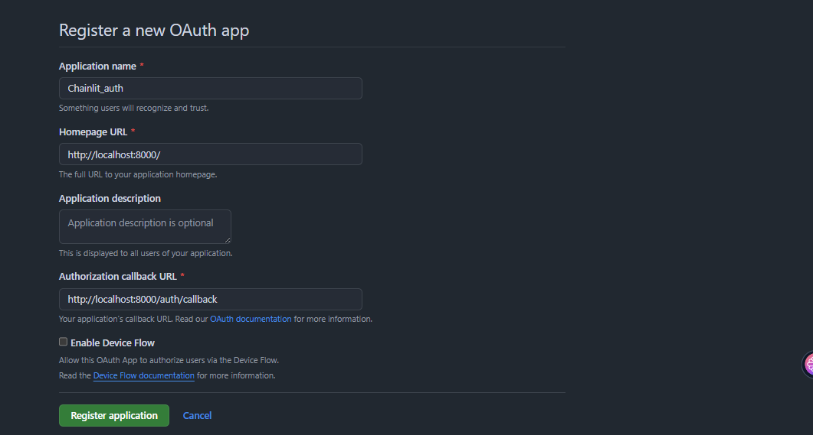
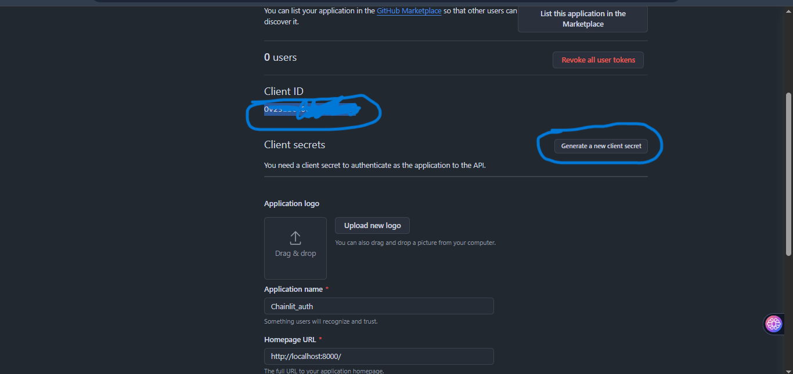

# Chainlit Chatbot with OpenAI Agents
A simple Chainlit-based chatbot project using openai-agents.


### 📁 Getting Started

### 1️⃣ Install UV 
First, install UV (if not already installed):
```bash
pip install uv
```

Check version:
```bash
uv --version
```


### 2️⃣ Create and Initialize the Project
```bash
uv init vs-code-example-Gemini-with-auth
cd vs-code-example-Gemini-with-auth
```


### 3️⃣ Install Dependencies
```bash
uv add chainlit google-generativeai python-dotenv
```

### 4️⃣ Activate UV Virtual Environment (Windows)
```bash
.venv\Scripts\activate

```

### 5️⃣ Try Chainlit Hello
```bash
chainlit hello
```
Go to the following URL:
```bash
http://localhost:8000
```

### 6️⃣ Create .env file
* GEMINI_API_KEY=your_gemini_api_key
* OAUTH_GITHUB_CLIENT_ID=your_github_client_id
* OAUTH_GITHUB_CLIENT_SECRET=your_github_client_secret
* CHAINLIT_AUTH_SECRET=your_chainlit_auth_secret


Get Google Gemini API key from https://aistudio.google.com/prompts/new_chat

Get GitHub OAuth Client ID and Client Secret.(Goto Github profile and goto this folder)

profile/ settings/ Developer settings/ OAuthApp / new OAuth app




**Generate chainlit auth secret with the following command:**
```bash
chainlit create-secret
```
Copy the generated values and paste it in the .env file.


### 7️⃣ Create chainlit.yaml file
Create a chainlit.yaml file in the root directory of the project and add the following code.
```bash

chainlit: 2.4.1

# Interface settings
ui:
  name: "Chainlit Chatbot"
  description: "A simple Question Answering Stateful chatbot with GitHub authentication built with Python, UV, and Chainlit."

# Message settings
default_expand_messages: true

# Auth settings
auth:
  required: true
  providers: 
    - github

# OAuth Configuration
oauth_providers:
  github:
    client_id: ${OAUTH_GITHUB_CLIENT_ID}
    client_secret: ${OAUTH_GITHUB_CLIENT_SECRET} 

```    

### 8️⃣ Run Authentication Chatbot (Web App)
```bash
chainlit run main.py -w
```

First login with GitHub, and then enter your question and send the message, and you should see the answer from the LLM, and the chatbot will remember your previous messages.

