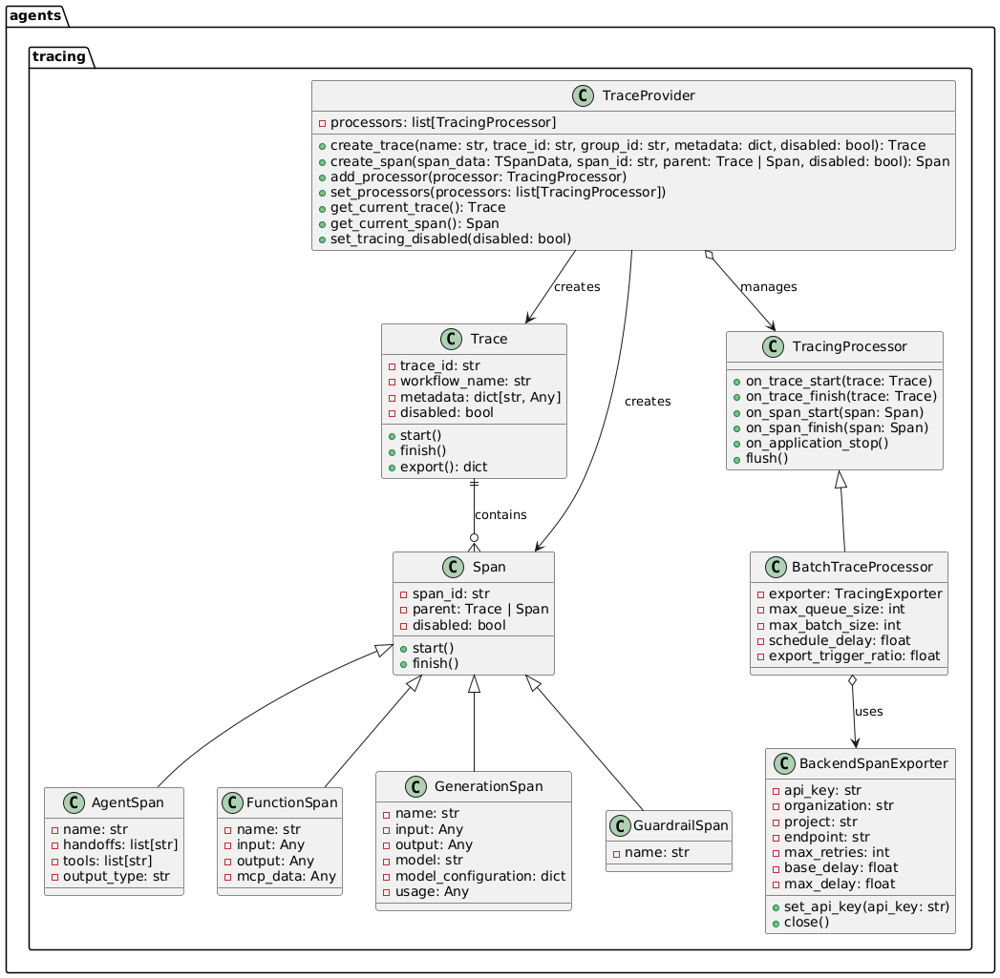

### Tracing
The Agents SDK includes built-in tracing, collecting a comprehensive record of events during an agent run: LLM generations, tool calls, handoffs, guardrails, and even custom events that occur. Using the Traces dashboard, you can debug, visualize, and monitor your workflows during development and in production.

#### Tracing is enabled by default. There are two ways to disable tracing:
1. You can globally disable tracing by setting the env var OPENAI_AGENTS_DISABLE_TRACING=1
2. You can disable tracing for a single run by setting agents.run.RunConfig.tracing_disabled to True

### External tracing processors list
1. Weights & Biases
2. Arize-Phoenix
3. Future AGI
4. MLflow (self-hosted/OSS
5. MLflow (Databricks hosted
6. Braintrust
7. Pydantic Logfire
8. AgentOps
9. Scorecard
10. Keywords AI
11. LangSmith
12. Maxim AI
13. Comet Opik
14. Langfuse
15. Langtrace
16. Okahu-Monocle
17. Galileo
18. Portkey AI
19. LangDB AI

