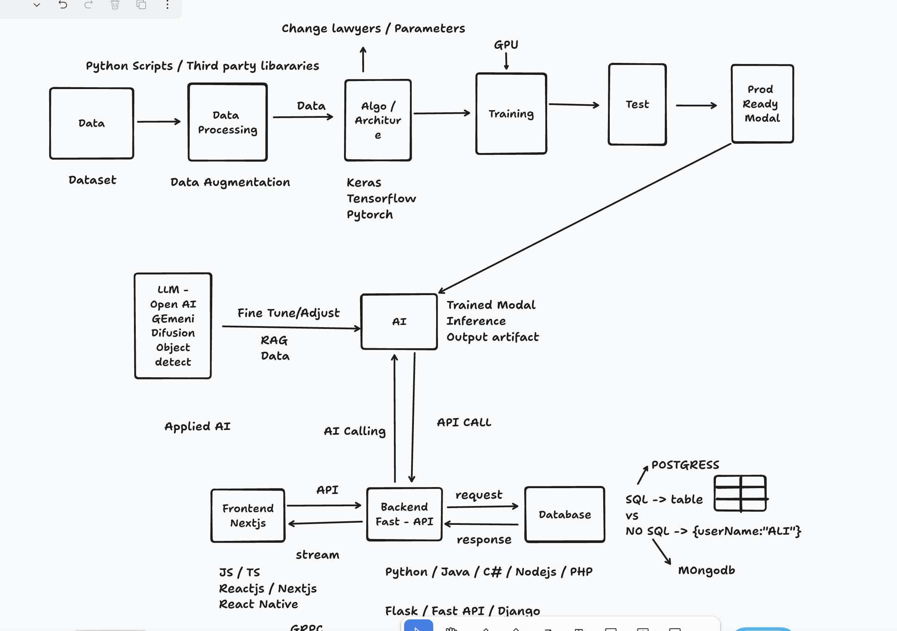

## software pehly kesa chalta tha.
### software 3 layers architecture pr work krta hain.

**1. FrontEnd:**
FrontEnd backend se comunicate krta ha using differnt procols like http,Ws://url (web sokets), GRPC.fontend backend se api ke through backend se baat krta hain.
* FrontEnd languages(Reactjs,nextjs,React Native)

1. GRPC: 
2. Ws://url (web sokets):
3. http:  SEcured Comunication (Data encrypted)

**2. BackEnd:** 
yaha hum apny code ki logics rakhty hain.
* backend languages(python,java,C#,nodejs,php)
* backend FrameWork(Flask, Fast api, Django)

**3. Database:**
backend request krke database me store kryga. or reponse lekr wapis backend ke pass ayega. backend frontend ke pass wapis
data bjh dega. request or response wala cycle chaly ga.

* sql database (data sturcture way me hota ha tabel or row hoti ha.data tabular form me hota ha)(famous database postgress)
* non sql database (data dictory ki form me hota ha store)(famous database mongodb)

## Introduce New Laywers With Ai
process sara wohi rahyga frontend se backend or backend se database.change ismy ye aya ha backend se eik or ai laywer
add hogi ha. backend ye check kryga ai ko call krna ha ya nh.jo jawab ayega wo frontend ya database me nhj dega.
ai ke differnt name 
* train model (train model wo hoty ha jo jinky pass informaiton hoti ha)
* inference (inference matlb model apny train data ke context pr hummy new data genrate krke de)
* output artifact

### Model:
model eik tarha ka brain hota ha. 

### Other LLM:
* llm
* open ai
* gemini
* Difusion
* object detect

### Fine Tune:
Fine Tune matlb pehly se bany howy model ko apny according apni need ke lihaz se adjest krna.fine tune me pehly se
bany model ko retrain krty ha apny data ke uper.

* Example:
   * agr apky pass eik remote ha ap cahaty ha usky buttons black color me ho. ap agr remote khol kr usky button change
   krke black button laga do to that is called finee tuning.

### RAG Application
Fine Tune se bhi asan cheez rag hain. rag me hum pehly se bany howy model ko retrain nh krty.jo kam apny model se krwanaha hena wo kam issy input request krdo.
* Example:
   * RAG me hum request me he batayengy ap eik banay howy model ho. apki jo bhi tumari logic ha wo thek ha lekin.tum ny jaha se on off hona hena waha se volume up down kro.

### What is Applied api:
Applied ai me hum bany howy model ko use krke fronend backend ka use krke apny application ka architecture banty hain.
that is called Applied ai.agr hum mode khud banaye to Model Architechture nechy mojood hain.

## Model Architechture

**First Step:**
* Data (Dataset)

**Second Step:**
* Data Processing

**Thired Step:**
* Architechture

**Fourth Step:**
* Training

**fivth Step:**
* Testing

**six Step:**
* Prod Ready Model

* Model Ready hony ke bad Ai Se contect krke dengy isi tarha humara ai lawer wala Step complete hota hain.